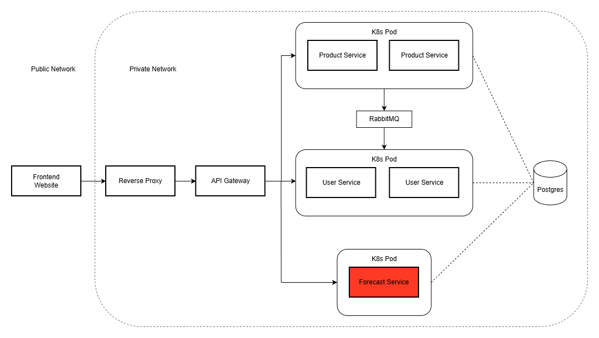

# Forecast Service

[](https://opensource.org/licenses/MIT)

## Overview

<p>
  
</p>

## Documentation

[](https://thelastfork.shop/api/forecastservice/docs)

## Tech Stack

### Core


### Machine Learning


### Database


### Deployment


### Testing


## How to Run Tests
> Intructions for **all microservices** can be found on the [**LocalDeployment**](https://github.com/Team-Tiger1/LocalDeployment) repo but the below instructions are for running just the Forecast service tests
### Requirements for running tests
- **Git**
- **Python 3.12** 
- Poetry
### If on linux
- pipx (Install Poetry through pipx if using linux)
# Run Tests 

### Run Tests (Windows)

1. Open Terminal, Clone and open this repository
```Bash
  git clone https://github.com/Team-Tiger1/ForecastService

  cd ForecastService
```
2. **If** you have multiple versions of python installed or are using a service like pyenv make sure to run the command below
```Bash
  poetry env use 3.12
```

3. run the following commands to install packages/enviornment and to run tests
```Bash
    poetry install 
    poetry run pytest
```
3. If successful you should see somthing similar to 
```Bash
  ======================== 3 passed, 6 warnings in 4.90s =========================
```

###  Run Tests (Linux)
1. Clone this repository
``` Bash
    git clone https://github.com/Team-Tiger1/ForecastService

    cd ForecastService
```

2. Install Pipx if not installed already 
>Only use the below installation method on Ubuntu/Debain Based Linux Distrubutions, if you are on another Linux Distribution
go to https://pipx.pypa.io/stable/installation/
```Bash
  sudo apt update
  sudo apt install -y pipx
  pipx ensurepath
```
3. install poetry using pipx
```Bash
  pipx install poetry
  source ~/.bashrc
```
4. **If** you have multiple versions of python installed or are using a service like pyenv make sure to run the command below
```Bash
  poetry env use 3.12
```


5. run the following commands to install packages/enviornment and to run tests
```Bash
    poetry install 
    poetry run pytest
```

6. If successful you should see somthing similar to 
```Bash
  ======================== 3 passed, 6 warnings in 4.90s =========================
```

### Run Tests (MacOs)

1. Open Terminal, Clone this repositiory (If Not done so already)
``` Bash
    git clone https://github.com/Team-Tiger1/ForecastService

    cd ForecastService
```

2. Turn off AirPlay Receiver
> Airplay Reciever uses port 5000 which our Forecast service uses
- Go to System Prefrences
- General -> AirDrop & Handoff
- Turn off __AirPlay Reciever__

3. **If** you have multiple versions of python installed or are using a service like pyenv make sure to run the command below
```Bash
  poetry env use 3.12
```

4. run the following commands to install packages/enviornment and to run tests
```Bash
    poetry install 
    poetry run pytest
```

5. If successful you should see somthing similar to 
```Bash
  ======================== 3 passed, 6 warnings in 4.90s =========================
```

## Contribution
**Author: Alex Greasley**

<br>

**Author: Jed Leas**

- Setting up all CI/CD workflows to handle 
    1. Automatic testing on push of main branch on the forcast service repo
  2. Automatic Deployment onto k3s with zero downtime on compleation of automatic testing so broken code wont make it to deployment
- And Sorting out bug fixes and connections between each microservices to the forecast service and set up the connection to the postgre database
- Helped with bug fixing of Auth and Forecast service

**Author: Daniel Jackson**
- Used pip-licenses to check permissions of python module licenses (Software Inventory)
